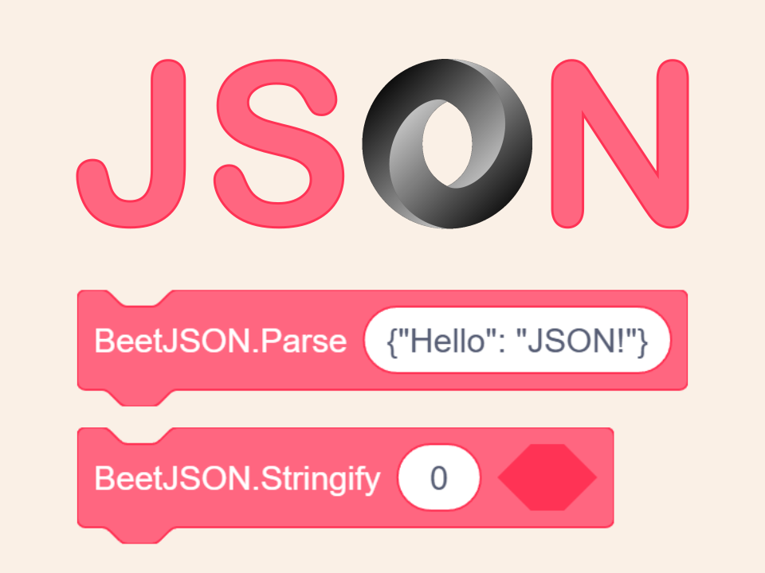

Parse & Stringify JSON in Scratch

🔗 Official Link:  
    https://pbf.im/beetjson  

🔗 Communities:  
    https://scratch.mit.edu/projects/1181734363/  
    https://gitblock.cn/Projects/1401940  
    https://create.codelab.club/projects/101298/  
    https://codingclip.com/project/6470  
    https://www.ccw.site/detail/6836cc19ca0107691ac00462  
    https://world.xiaomawang.com/community/main/compose/PA40666J  
    https://www.cocrea.world/@bddjr/BeetJSON  
    https://40code.com/#page=work&id=1229  
    https://axopl.com/project_play/756  

🕗 Download History Versions:  
  https://github.com/bddjr/BeetJSON/releases
